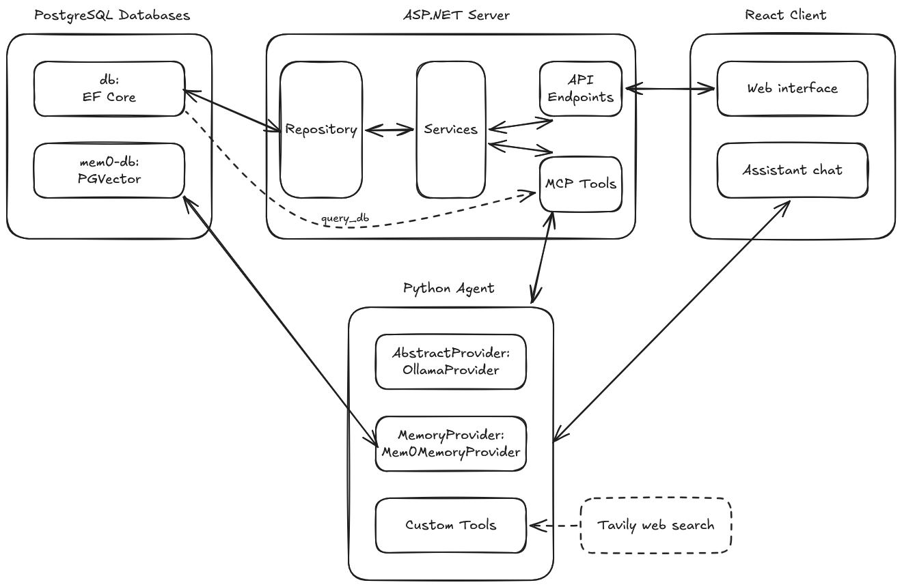

# Project Specification — EStoreAPI

## 1. Overview

EStoreAPI is a repair shop management system for internal staff use. It provides a digital job intake form that records customer and device details alongside the problems being repaired, a managed problem/price catalogue that generates a quote suggestion for each job, and tools to track job status and look up customer repair history. The system is designed as a scalable foundation for future operational features.

> This system is a modernisation of a legacy PHP web app that first digitised the shop's original paper-and-spreadsheet workflow.

---

## 2. Goals & Non-Goals

### Goals

-  Provide a digital job intake form that links a customer, device, and selected problems
-  Provide an easy way for staff to manage repair pricing (add, update problems and their prices per device)
-  Generate a quote suggestion from selected problems, adjustable by the technician to account for discounts
-  Allow staff to look up customer repair history and track job status
-  Establish a clean, scalable architecture that supports future feature growth
-  **The app can be entirely managed through an AI agent if needed; A chatbox should be available with an agent that can call APIs to manage and display data if needed**

### Non-Goals

- Customer-facing portal (internal staff tool only)
- Inventory or parts management
- Payment processing or invoicing

---

## 3. Users & Roles

| Role | Description | Permissions |
|------|-------------|-------------|
| Staff | Counter and technician staff who create and manage jobs | Full CRUD on jobs, customers, devices, problems |
| AI Agent | An AI agent that staff can talk and upload files to, who can automate the management process | Full CRUD on jobs, customers, devices, problems; requires staff consent via chatbox |

All roles require a user account with password authentication to access the system. User management is infrequent and handled administratively (e.g. direct database queries or a basic admin interface).

---

## 4. Functional Requirements

### 4.1 Customer Management

- [x] Create, read, update, delete customer records
- [x] Search customers by name or phone number

### 4.2 Device Management

- [x] Create, read, update device models
- [x] Search devices by name or type
- [x] Associate known problems with devices
- [ ] Support one-off or obscure devices without needing entry into the database

### 4.3 Problem Catalogue

- [x] Maintain a list of common problems per device model, each with a set price
- [x] Allow staff to add, update, and remove problems and their prices

### 4.4 Job Management

- [x] Create a job linking a customer, a device, and one or more problems
- [x] Support jobs where the problem is unknown at intake
- [x] Record receive time; set estimated and actual pickup times
- [x] Capture an estimated price and a final collected price
- [x] Mark a job as completed
- [ ] Set warranty status for a completed job based on warranty policy timeframe
- [ ] Allow new jobs to be linked to an existing job as warranty repair

### 4.5 Authentication

- [x] All API routes require a valid authenticated session
- [ ] <s>User accounts stored in the database with hashed passwords</s> (Google OAuth is used instead)
- [x] User creation and modification handled administratively (no self-registration)

### 4.6 Frontend

- [x] Login interface for authentication
- [x] Job intake form links customer, device, and selected problems in one submission; price input shows the sum of selected problem prices as a placeholder, which the technician can accept or override
- [x] Job list view showing outstanding and completed jobs
- [x] Customer lookup to retrieve repair history

### 4.7 AI Agent
- [x] A chatbox that is easily accessible from anywhere on the app
- [x] Have the ability to upload files, such as pictures, documents, spreadsheets, for single or bulk import of data
- [x] From prompts, be able to call upon provided APIs to make changes to the database
- [ ] From prompts, be able to redirect the user to their desired pages and apply any requested filters closest to the user's request

---

## 5. Non-Functional Requirements

| Concern | Requirement |
|---------|-------------|
| Availability | Must be available during business hours, downtime acceptable outside of these; Ideally 24/7 availability |
| Performance | UI interactions should feel immediate for in-person job intake |
| Security | Hosted on a public URL; all routes protected behind authentication |
| Scalability | Architecture should support adding new features (e.g. reporting, notifications) without major rework |
| Data retention | Job and customer records kept for warranty and history purposes; stale customer records (no active warranty and no activity for 5 years) removed for privacy |
| Privacy | All customer data is kept within the server computer; no data is given to any 3rd party providers |

---

## 6. Architecture

### 6.1 Tech Stack

| Layer | Technology |
|-------|-----------|
| Backend API | `ASP.NET` Core 10 (C#) |
| Database | PostgreSQL via Entity Framework Core 10 |
| Frontend | React + Vite (TypeScript) |
| API docs | Swagger / OpenAPI |
| Containerisation | Docker (5-image setup: API, client, DB, agent, memory DB) |
| AI provider | Ollama (Python API), locally hosted or with private cloud |
| AI interface | React assistant-ui |
| AI web search | Tavily |
| AI memory | mem0 |
| Authentication | Google OAuth |

### 6.2 High-Level Architecture

### 6.3 Data Model

The Device entity represents a device model rather than individual devices.
The Problem entity represents the generic problems a device model may have.

---

## 7. API Summary

| Resource   | Base path          |
|------------|--------------------|
| Customers  | `/api/customers`   |
| Devices    | `/api/devices`     |
| Jobs       | `/api/jobs`        |
| Problems   | `/api/problems`    |
| Form       | `/api/form`        |
| AI Agent   | `/api/agent`       |
| Authentication | `/api/auth`    |

---

## 8. Future Work
- Tracking of external partners (jobs handed off to partner repair shops/technicians)
- Tracking inventory stock of parts